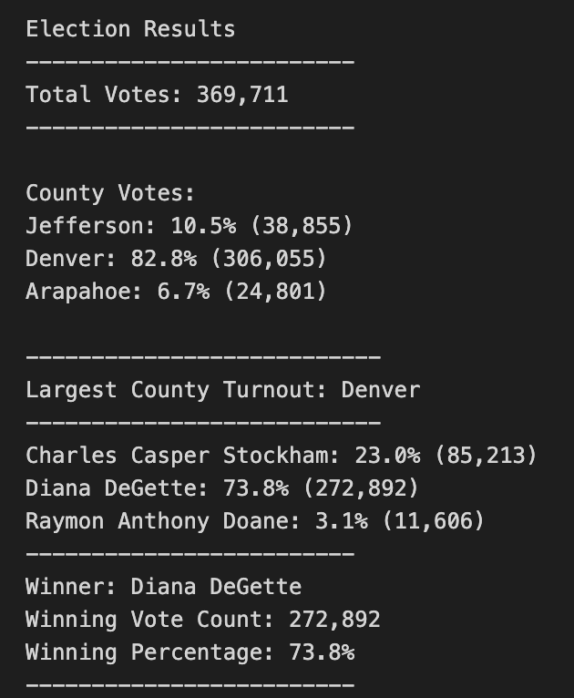

# Election_Analysis

## Overview of Election Audit
The Colorado Board of Elections (CBE) has requested an audit to be performed on a recent local congressional election. An Election Results .csv file formatted to provide data in the form of: ballot ID numbers, names of counties participating in the election, and the candidates being voted for has been made available to use as the dataset needed to perform the requested analysis of the election outcomes. 

The output that the CBE has requested is available in the **Election Audit-Results** section of the anyalysis report. At the end of the analysis, the viability of the code used for this analysis will be discussed. 

## Resources
- Data Source: election_results.csv
- Software: Python 3.7.6, Visual Studio Code, 1.38.1

## Election Audit-Results

* How many votes were cast in this congressional election?
  * Total Votes: 369,711

* Provide a breakdown of the number of votes and the percentage of total votes for each county in the precinct.
  * County Votes:
    * Jefferson: 10.5% (38,855)
    * Denver: 82.8% (306,055)
    * Arapahoe: 6.7% (24,801)

* Which county had the largest number of votes?
  * Largest County Turnout: Denver (306,055)
  
* Provide a breakdown of the number of votes and the percentage of the total votes each candidate received.
  * Voting Breakdown Per Candidate:
    * Charles Casper Stockham: 23.0% (85,213)
    * Diana DeGette: 73.8% (272,892)
    * Raymon Anthony Doane: 3.1% (11,606)

* Which candidate won the election, what was their vote count, and what was their percentage of the total votes?
  * Winner: Diana DeGette
  * Winning Vote Count: 272,892
  * Winning Percentage: 73.8%

## Election-Audit Summary
Code used to extract the results is designed for future use for the State of Colorado's Election Results. A few points to consider:
  * the formatting of future source files used to derive the same analysis provided in this report would ideally be the same (Ballot ID, County Name, and Candidate name)
    * If the format is different, the structure of the code is set up with a low amount of static data, so that variables can be altered and added if necessary
  * Separate files for each election to be analyzed are required instead of receiving a consolidated file that houses multiple elections 
